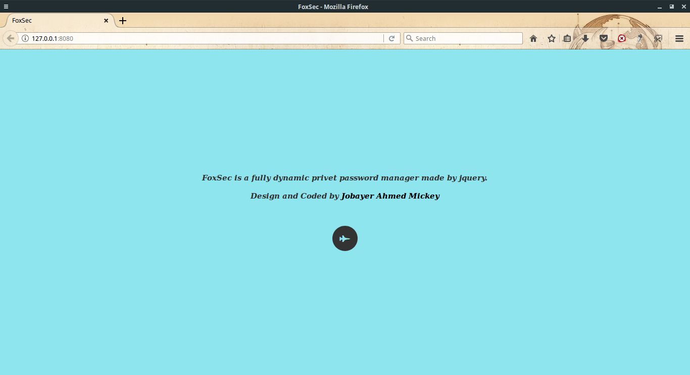
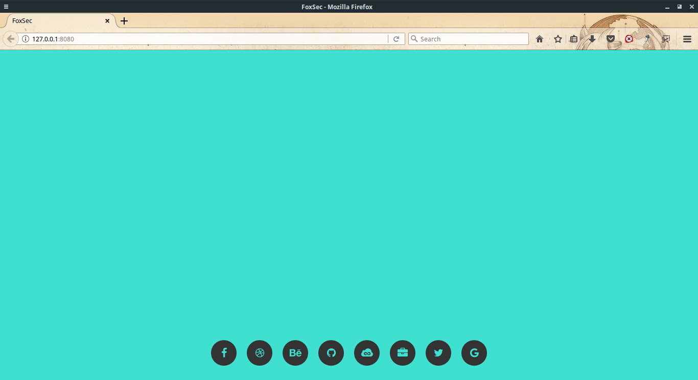
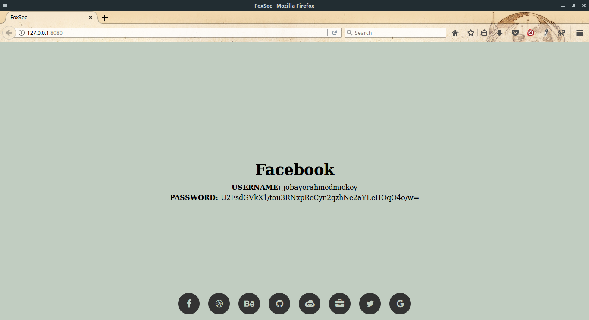
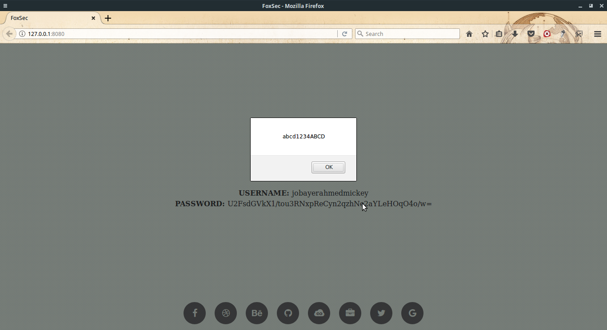

# FoxSec

fully dynamic private password manager made by jquery. Fully Secure and Private.

### Screenshots



##### Wellcome Page




##### Logo Page




##### Show Username




##### Show Password


### How to Use:

Download and install **[NodeJs](https://nodejs.org/en/download/)** on your computer.

Download project file from **[Here](https://github.com/Jobayer-Ahmed/FoxSec/archive/master.zip)**

For install **live-server:**

``` bash
cd [Project_path]
npm install -g live-server
```

### Launch and Edit

``` bash
cd [Project_path]
live-server
```

To make change siteName, userName, passWord just edit assets/json/userName.json

That's It